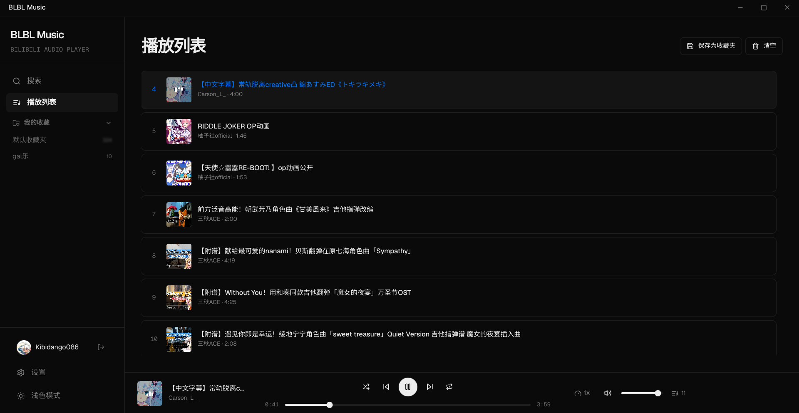

# BLBL Music Player

> — 把 B 站变成你的音乐库

---

## 简介

BLBL Music Player 是一款基于 Electron 构建的桌面应用，让你能够以音乐播放器的形式体验 Bilibili 视频内容。

## 功能特性

- **B站搜索** — 直接在应用内搜索 Bilibili 视频
- **播放列表** — 创建和管理自己的播放队列，支持拖拽排序
- **收藏夹浏览** — 登录后可浏览 B 站收藏夹内容
- **多语言** — 简体中文 / 繁体中文
- **网络代理** — 支持 HTTP/HTTPS/SOCKS 代理及认证
- **跨平台** — Windows、macOS、Linux

## 截图

此图截自 Linux 版本。



## 安装

从 [Releases](https://github.com/Kibidango086/BLBL-music-player/releases) 页面下载对应系统的安装包：

| 平台 | 格式 |
|------|------|
| Windows | `.zip` |
| macOS | `.dmg` |
| Linux | `.AppImage` / `.deb` / `.rpm` |

### 从源码运行

```bash
# 克隆仓库
git clone https://github.com/Kibidango086/BLBL-music-player.git
cd BLBL-music-player

# 安装依赖
bun install

# 开发模式
bun run electron:dev

# 构建
bun run build
```

## 技术栈

- [Electron](https://www.electronjs.org/) 30
- [React](https://react.dev/) 18
- [TypeScript](https://www.typescriptlang.org/)
- [Tailwind CSS](https://tailwindcss.com/)
- [shadcn/ui](https://ui.shadcn.com/)
- [Zustand](https://github.com/pmndrs/zustand)

## 开发

### 项目结构

```
.
├── electron/           # Electron 主进程 & 预加载脚本
│   ├── main.ts
│   ├── preload.ts
│   └── bilibili.ts     # Bilibili API 封装
├── src/
│   ├── components/     # React 组件
│   ├── store/          # Zustand 状态管理
│   ├── i18n/           # 国际化字典
│   ├── lib/            # 工具函数
│   └── types/          # TypeScript 类型定义
├── public/             # 静态资源
└── package.json
```

## 协议

[MIT](LICENSE)

## 声明

- 本项目由 @Kibidango086 维护
- 使用本软件与作者无关
- 平台内容归属 Bilibili 公司所有

---

> 设计灵感来自 [Vercel](https://vercel.com/) / [Geist](https://vercel.com/font)
